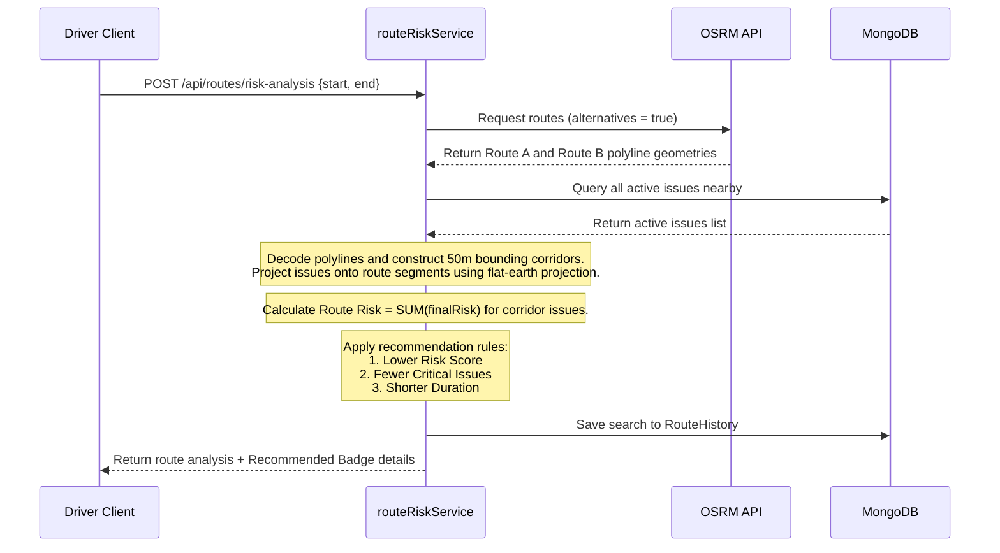

# 🏗️ CivicGuard System Architecture

This document describes the architectural design, core components, and data processing pipelines of the CivicGuard Civic Risk Intelligence Platform.

---

## 🗺️ High-Level System Architecture

CivicGuard is built on a modern decoupled client-server architecture. The frontend is a Next.js App Router project that builds statically using Webpack. The backend is a Node.js Express server running on MongoDB.

```mermaid
graph TD
    subgraph Client [Frontend - Next.js]
        A[Citizen / Reporter] -->|Report / Upvote| C[Report UI]
        B[Field Crew / Drivers] -->|Safer Navigation| D[Driver Routing UI]
        E[Municipal Authority] -->|Operations Command| F[Command Center / Simulator]
    end

    subgraph API Gateway [Express Web Server]
        G[Helmet Headers / Cors / Compression]
        H[express-rate-limit]
        I[RBAC Middleware / JWT Validation]
        J[Magic Signature File Checker]
        G --> H --> I --> J
    end

    subgraph Service Layer [Core Processing Services]
        K[RiskEngine]
        L[ForecastService]
        M[aiClassificationService]
        N[routeRiskService]
        O[escalationAlertService]
    end

    subgraph External [External APIs]
        P[OSRM Routing Server]
        Q[REST LLM Classifier]
    end

    subgraph Database [Storage Layer]
        R[(MongoDB / Mongoose)]
    end

    Client -->|HTTP Requests / File Uploads| API Gateway
    API Gateway -->|Controller Routing| Service Layer
    Service Layer -->|Read/Write Schemas| Database
    routeRiskService -->|Fetch Path Geometries| P
    aiClassificationService -->|Get Category Confidence| Q
```

---

## 🚗 Component Deep-Dives

### 1. Frontend Architecture
Built using **Next.js 16 (App Router)** and compiled statically with **Webpack**. It interfaces with the backend via a centralized Axios instance.
*   **Routing Layout**:
    *   `/` - Landing page with public maps and key city statistics.
    *   `/dashboard` - Detailed public analytics, issue heatmaps, and category charts.
    *   `/report` - Citizen issue upload form (accepts geolocations and images).
    *   `/driver` - Driver page incorporating Leaflet routing, primary vs alternative risk corridor comparisons, and recommended route badges.
    *   `/authority` - Operations command panel containing queues, simulator planner checkboxes, and a 30s auto-polling live alert feed.
    *   `/authority/forecast` - Forecasting panel detailing CRI projections, emerging spikes alerts, and future weather simulations.

### 2. Backend Security & Routing Gateway
Configured with strict security policies to handle high traffic and prevent malicious inputs:
*   **Brute-Force Lockout**: Captures consecutive login failures on the User document, locking accounts for 15 minutes upon the 5th failure.
*   **File Signature Inspection**: Intercepts report image uploads via multer. Reads the file buffers to match magic bytes (JPEG: `FF D8 FF`, PNG: `89 50 4E 47`, WEBP: `RIFF...WEBP`) and rejects disguised executables.
*   **Token Rotation**: Rotates refresh tokens on every request to prevent session hijacking.

### 3. Dynamic Risk Engine
Calculates the dynamic risk value ($0$ to $100$) of unresolved issues using a rules-based scoring algorithm:
$$\text{RiskValue} = (\text{BaseSeverity} \times 0.5) + (\text{FrequencyScore} \times 0.3) + (\text{NeighborhoodDensity} \times 0.2)$$
*   **Base Severity**: Mapped by category (`pothole` = 60, `garbage` = 40, `sewer` = 80, `construction` = 50).
*   **Frequency Score**: Incremented by citizen votes and upvotes ($10 \times \min(\text{votes}, 10)$).
*   **Neighborhood Density**: The number of surrounding active issues within a $500\text{m}$ radius.
*   **Weather Multipliers**: Applied dynamically (Rainy = $1.2\times$, Stormy = $1.5\times$).
*   **Time factor**: Escalates unresolved issues at $75\%$ of their SLA deadline (adds $1.5\times$ base factor) and $100\%$ deadline breach (adds $2.0\times$ base factor).

### 4. Predictive Forecasting Engine
Calculates the overall **Civic Risk Index (CRI)** of the city and its neighborhoods:
*   **CRI Stands**: Combined index representing:
    $$\text{CRI} = (0.5 \times \text{AvgRisk}) + (0.3 \times \text{IssueDensity}) + (0.2 \times \text{CriticalProportion})$$
*   **Projections (7d, 14d, 30d)**: Accumulates projected unresolved issues while applying weather modifiers.
*   **Explainability Drivers**: Translates mathematical risks into human-readable action triggers (e.g. `CRI spike driven by 5 unresolved sewers breaching SLA`).

### 5. Route Risk Corridor Analysis (OSRM Routing)
Evaluates OSRM driving geometries to identify safer routing paths:


### 6. Live Escalation Alerts
Detects localized report spikes to warn command centers in real time:
*   **Temporal Check**: Groups reports uploaded within the last hour by reverse-geocoded location names.
*   **Threshold Trigger**: If $\ge 3$ reports are logged in a single cluster, triggers an `EscalationEvent`.
*   **Severity Rating**: Maps risk increase against baseline CRI levels:
    *   $\ge 25\%$ increase $\rightarrow$ **Critical**
    *   $10-25\%$ increase $\rightarrow$ **Warning**
    *   $<10\%$ increase $\rightarrow$ **Info**
*   **Anti-Spam Filter**: Limits location clusters to a maximum of one escalation event per hour.

### 7. AI-Assisted Issue Classification
Standardizes incoming reports and validates citizen categorization:
*   **Text Classification**: Converts titles and descriptions into standardized categories using LLM prompts.
*   **Category Normalization**: Resolves typos and synonyms (e.g. `"ruptured pipes"` or `"drainage leak"` $\rightarrow$ `"sewer"`).
*   **Override Engine**: Flagged if LLM classification conflicts with the user's selected category. Keeps user categorization but records the mismatch telemetry for administrative audits.
